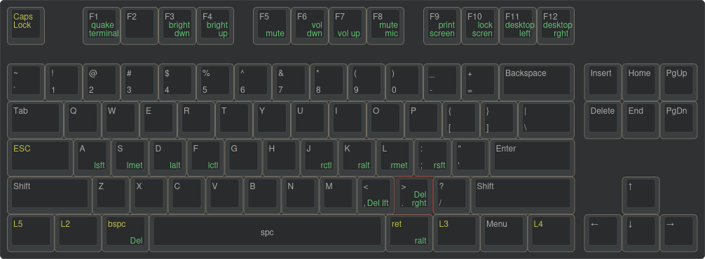
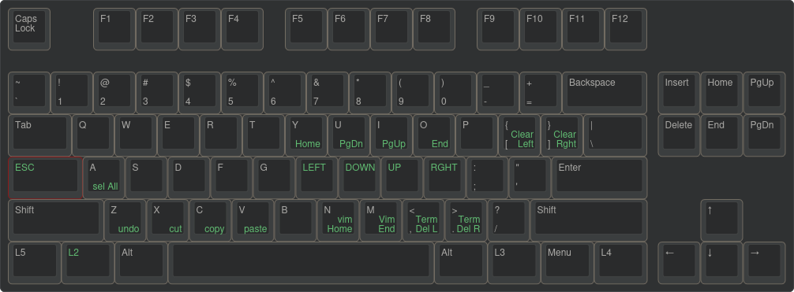
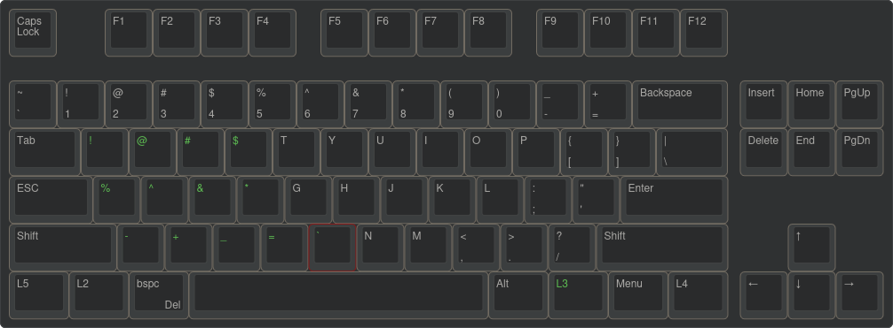
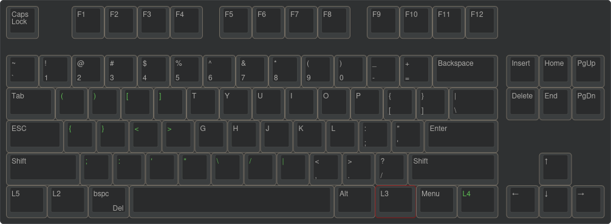

# keyHack-kanata

### Philosophy

- Keep keyboard use simple and focused around the home row - so when one hand triggers a layer or an action the other triggers a shortcut
- Incorporate VIM - arrow movements
- Incorporate useful editing features
- Incorporate Terminal shortcuts
- many options have been set to do a secondary action if the key is held down.
- Switching between the layers the corresponding layer button only needs to be held.

**There are 4 layers in all.**

### Layer 1 - Main use



- caps and esc key swapped
- f1-f12 - control quake terminal dropdown, brightness, volume, screenshots, and swapping desktops left and right
- Home Row Mods (reflective) - Shift, Meta, Alt, Ctrl and simply reflected on the right hand side Ctrl, Alt, Meta Shift
- bspc/Del key to the left of the space bar
- return/Alt-grub key to the right of the space bar
- Useful shortcuts for deleting a word  left/right

&nbsp;

### Layer 2 - Navigation with text in the the terminal


&nbsp;
With L2 held on your left hand

- Access useful terminal shortcuts and also use combination keys
- VIM HJKL used to control arrow movement when moving the cursor
- VIM - go to the beginning of the line with n when held equivalent of hitting 0
- VIM - got to the end of the line with m when held equivalent of hitting $
- Useful shortcuts for deleting a word from the terminal left/right
- delete the line before/after the cursor in the terminal
- Select all, undo, cut, copy and paste

&nbsp;

### Layer 3 - Symbols layer



with L3 held on your right hand

- access all the SYMBOLS needed with your left hand

&nbsp;

### Layer 4 - Brackets



with L4 held on your right hand

- access all the BRACKETS needed with your left hand

&nbsp;

[](#)[](#installation)

- To get keyHack, check out this repository with Git. Download the kanata.kbd to get started. to install Kanata follow the instructions below.
- Launch `kanata.kbd` with Kanata.
  - You can install Kanata by downloading a [pre-built executable](https://github.com/jtroo/kanata/releases).
  - Follow the installation details of your operating system.

LINUX

### Run Kanata without `sudo`

[](#)[](#run-kanata-without-sudo)

kanata needs to intercept `uinput` signals, which it cannot do without the proper authorisations.

If you don’t want to run `kanata` with `sudo`, you’ll need to allow Kanata to read from `uinput`. This requires the users to be part of both `input` and `uinput` groups.

For that, you first need to create a `uinput` group if it doesn’t exist yet:

```shell
sudo groupadd -U $USERNAME uinput
```

where `$USERNAME` is the target user (or users in a comma-separated list). Then add the target user (or users) to the group input:

```shell
sudo usermod -aG input $USERNAME
```

You can check after re-logging that both groups appear in the result of the `groups` command launched as the target user.

Finally, you need to add a udev rule in `/etc/udev/rules.d/50-kanata.rules`:

```
KERNEL=="uinput", MODE="0660", GROUP="uinput", OPTIONS+="static_node=uinput"
```

### Making a user-side `systemd` service for Kanata

[](#)[](#making-a-user-side-systemd-service-for-kanata)

Note: This only works if `kanata` is able to run without `sudo` (and is using `systemd`).

Using a `systemd service` allows running `kanata` as a daemon, possibly right after logging in. Here is a template for a service file:

```
[Unit]
Description=Kanata keyboard remapper
Documentation=https://github.com/jtroo/kanata

[Service]
Environment=PATH=/usr/local/bin:/usr/local/sbin:/usr/bin:/bin
Environment=DISPLAY=:0
Environment=HOME=/path/to/home/folder
Type=simple
ExecStart=/usr/local/bin/kanata --cfg /path/to/kanata/config/file
Restart=no

[Install]
WantedBy=default.target
```

Copy-paste it into `~/.config/systemd/user/kanata.service`, fill in the placeholders, then run one of the following commands:

- `systemctl --user start kanata.service` to manually start `kanata`
- `systemctl --user enable kanata.service` so `kanata` may autostart whenever the current user logs in
- `systemctl --user status kanata.service` to check if `kanata` is running
